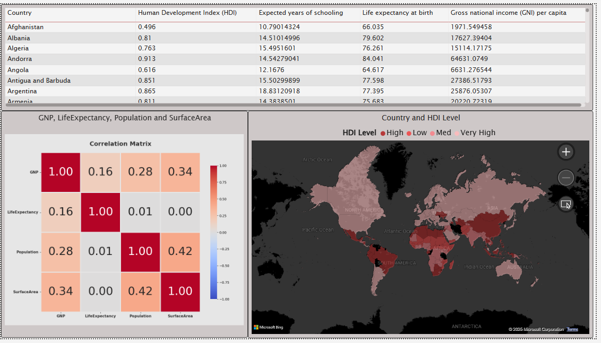

# 🌍 World Data Analysis — End-to-End BI & Analytics Project
# _________________________________________________________________

A complete analytics pipeline using Python, SQL, and Power BI to explore global development, population, economy, and HDI indicators.

## 📌 Project Overview

This project simulates a full real-world BI workflow, starting from collecting and preparing raw global datasets, cleaning them with Python, validating joins and structures using SQL, and building a multi-page Power BI dashboard for data storytelling.

The analysis integrates economic, demographic, linguistic, and human-development indicators to provide a wide view of world patterns and trends.

**Note:** The dataset used is structured but not fully up-to-date.
This project is designed as a training simulation to practice real analytical workflows.

## 🎯 Objectives

-Combine data from multiple sources (Python, SQL, Excel, scraped datasets)

-Clean, reconcile, and standardize global indicators

-Perform EDA (Exploratory Data Analysis) using Python

-Build star-schema-ready tables for BI modeling

-Develop an interactive Power BI dashboard with KPIs, maps, correlations, and drill-downs

-Produce actionable insights for decision-makers and researchers

## 🛠 Technologies Used

#### Python: pandas, NumPy, matplotlib, seaborn

#### Jupyter Notebook for analysis documentation

#### MySQL for queries, validation & aggregation

#### Power BI for modeling (relationships, DAX) & visuals

#### Web Scraping (optional) for enriching country-level indicators

## 📁 Project Structure
world-analysis/  
│ 
├── notebooks/             
│   └── world_analysis.ipynb  
│ 
├── data/ 
│   ├── raw/                  # original files
│   ├── cleaned/              # cleaned tables for modeling
│   └── world.sql             # SQL exports used in analysis
│ 
├── sql/ 
│   └── data_prep_queries.sql 
│ 
├── dashboard/ 
│   └── world_data_report.pbix 
│ 
└── images/ 
    ├── Main Page.png 
    ├── HDI.png 
    ├── Filter Page.png 

## 🧹 Data Cleaning & Preparation
### ✔ Performed using Python (pandas) + SQL

Included:

#### Identifying & correcting missing values

#### Fixing inconsistent formats

#### Converting GDP text values like:

"3.5 trillion$"

"850B"

"1.2 billion"
→ into normalized numerics

#### Standardizing country names & ISO codes

#### Removing duplicate records

#### Creating derived metrics (e.g., HDI categories, GDP-per-capita groups)

#### Merging datasets from multiple sources (SQL tables + Excel files)

#### Validating joins using SQL queries

#### Exporting final cleaned dataset for Power BI

## 🔍 Exploratory Data Analysis (Python)

Analysis performed inside the notebook included:

#### Summary statistics

#### Distribution analysis for GDP, population, HDI

#### Correlation matrix between economic & social indicators

#### Outlier detection

#### Ranking top/bottom populated countries

#### Extracting:
✔ Most spoken languages
✔ Highest GNP economies
✔ Countries with lowest life expectancy
✔ Cross-continent comparisons

Final visuals were re-created in Power BI for better storytelling.

## 📊 Power BI Dashboard

The dashboard includes:

### 📌 Global KPIs

Total population

Total GDP

Average life expectancy

Average HDI level

Growth statistics

### 🌍 Pages Included

Main Global Overview

HDI Page (Map + Indicators)

GDP & Population Trends

Country Profile Page (Drill-Down)

Filter Page

Mobile Layout

## 📸 Dashboard Screenshots
  

Dashboard file:
dashboard/world_data_report.pbix

## ⚙️ Challenges & Solutions
### 1️⃣ Multi-source data integration

**Challenge:** Different structures, formats, and naming conventions.
**Solution:** Standardized country keys, cleaned in Python, validated via SQL.

### 2️⃣ SQL → Power BI import issues

#### Encoding & column-type errors.
**Solution:** Re-typed columns inside Power BI + pre-cleaned SQL tables.

### 3️⃣ GDP values stored as TEXT

**Examples:** "$3.5 trillion", "850B", "1.2 billion"
**Solution:** Created a Python parser to convert all formats to numbers.

### 4️⃣ Visual storytelling & design

**Challenge:** Clean layout, balanced charts, mobile design.
**Solution:** Rebuilt visuals, improved spacing & formatting.

### 5️⃣ Dataset is not current

**Solution:** Documented limitations and future update plan.

## 💡 Key Insights from the Notebook

### ✔ Population Distribution:
Global population is extremely concentrated — a few countries dominate total world population.

### ✔ Economic Inequality:
GNP and GDP values show wide disparity between regions, with strong clustering patterns.

### ✔ Life Expectancy:
Countries with higher GDP tend to have significantly higher life expectancy.

### ✔ HDI Correlation:
HDI strongly correlates with education, GDP-per-capita, and healthcare indicators.

### ✔ Language Diversity:
High language diversity in Asia & Africa; lower diversity in regions with homogeneous populations.

These insights match and validate global development expectations and form the basis for dashboard storytelling.

## 🚀 How to Run the Project

1-Clone this repository

2-Open notebooks/world_analysis.ipynb

3-Run all cells to reproduce cleaning & EDA

4-Load cleaned data into SQL or directly into Power BI

5-Open dashboard/world_data_report.pbix

6-Explore dashboard & insights

## 🔮 Future Enhancements

-Build ML models to forecast GDP or life expectancy

-Add automated ETL pipelines (Airflow/Prefect)

-Connect to World Bank API for live data

-Publish Power BI report to cloud with scheduled refresh

-Add country clustering & segmentation

## 📬 Contact

#### LinkedIn: www.linkedin.com/in/asem-haij-9797562a8

# 🌍 مشروع تحليل بيانات العالم

هذا المشروع يقدّم سير عمل كامل لتحليل البيانات من البداية حتى النهاية، بدءًا من جمع البيانات الخام، مرورًا بتنظيفها باستخدام Python، ومعالجتها باستخدام SQL، وانتهاءً ببناء لوحة تحكم تفاعلية في Power BI لعرض النتائج وصناعة القصة البصرية.

يحاكي المشروع تجربة BI حقيقية عبر دمج بيانات من مصادر متعددة والتعامل مع تحديات البيانات الشائعة.

ملاحظة: رغم أن البيانات منظمة إلى حد ما، إلا أنها ليست محدثة بالكامل، لذا يُعد المشروع محاكاة تدريبية لتطبيق خطوات التحليل العملية.

## 🎯 أهداف المشروع

جمع واستكشاف وتنظيف البيانات من مصادر متعددة

معالجة القيم المفقودة وعدم الاتساق في الصيغ والأنواع

إجراء تحليل وصفي واستكشافي

استخدام Python وPandas وSQL لإعداد البيانات

بناء نموذج بيانات في Power BI وربط الجداول

تصميم لوحات تحكم تفاعلية لعرض البيانات وصياغة قصة بصرية قوية

## 🛠 الأدوات والتقنيات المستخدمة

Python (Pandas, NumPy)

Jupyter Notebook

SQL

Power BI

Web Scraping (عند الحاجة)

## 📂 هيكل المشروع
world-analysis/  
│ 
├── notebooks/             
│   └── world_analysis.ipynb  
│ 
├── data/ 
│   ├── raw/                  # original files
│   ├── cleaned/              # cleaned tables for modeling
│   └── world.sql             # SQL exports used in analysis
│ 
├── sql/ 
│   └── data_prep_queries.sql 
│ 
├── dashboard/ 
│   └── world_data_report.pbix 
│ 
└── images/ 
    ├── Main Page.png 
    ├── HDI.png 
    ├── Filter Page.png 

## 🧹 خطوات تنظيف البيانات

تحديد القيم المفقودة واتخاذ القرار المناسب لمعالجتها

إصلاح مشاكل التنسيق (النصوص، الأرقام، التواريخ)

تحويل الوحدات (مثل قيم الناتج المحلي GDP)

إزالة البيانات المكررة

توحيد أسماء/رموز الدول قبل الدمج

دمج البيانات القادمة من مصادر مختلفة

تصدير النسخة النهائية النظيفة من البيانات

## 🔍 التحليل الاستكشافي

تم باستخدام Python وشمل:

الإحصاءات الوصفية

تحليل التوزيعات

تحليل الارتباطات

كشف القيم الشاذة

مقارنة الميزات

تم تنفيذ معظم الرسوم البيانية لاحقًا في Power BI بشكل أكثر احترافية.

## 📊 لوحة تحكم Power BI

تتضمن:

مؤشرات عالمية (السكان، الناتج المحلي، معدل النمو … إلخ)

أعلى وأدنى الدول حسب المؤشرات

اتجاهات الناتج المحلي ومتوسط العمر

توزيع اللغات حول العالم

خريطة مؤشر HDI

مصفوفة الارتباط

صفحة تقارير تفصيلية لكل دولة

نسخة متوافقة مع الهاتف المحمول

  

ملف لوحة التحكم متوفر في:

dashboard/world dashboard.pbix
## ⚙️ التحديات والحلول
### 1️⃣ دمج البيانات من مصادر متعددة

التحدي: اختلاف التنسيقات والأسماء والهياكل 
الحل:

بناء نموذج بيانات في Power BI باستخدام مفاتيح موحدة

توحيد أسماء الدول باستخدام Python

التحقق من عمليات الدمج باستخدام SQL قبل الاستيراد

### 2️⃣ استيراد البيانات من SQL إلى Power BI

التحدي: مشاكل الترميز وأنواع البيانات 
الحل:

تنظيف البيانات أولًا في Python

ضبط أنواع الأعمدة في Power Query

تقسيم الجداول الكبيرة عند الحاجة

### 3️⃣ عمود الناتج المحلي GDP يحتوي على قيم نصية

أمثلة:

3.5 trillion$

850B$

1.2 billion

الحل:

إنشاء دالة Python مخصصة لتحويل جميع القيم النصية إلى أرقام

التحقق النهائي في Power BI عبر Transform Data

### 4️⃣ تحديات التصميم البصري

التحدي: بناء تصميم حديث ومنسق ومناسب للمستخدم 
الحل:

تحسين الألوان والمسافات والهوامش

إعادة بناء بعض الرسوم للحصول على أفضل عرض

تصميم نسخة خاصة بالهاتف المحمول

### 5️⃣ البيانات غير محدثة بالكامل

هذا المشروع يهدف إلى محاكاة سير عمل تحليلي واقعي أكثر من إعطاء إحصائيات عالمية حديثة.

## 💡 أهم النتائج

(يمكنك تعديلها حسب نتائجك الفعلية)

الدول ذات الناتج المحلي الأعلى غالبًا ما تمتلك متوسط عمر متوقع أعلى

التوزيع السكاني حول العالم غير متوازن بشكل كبير

بعض المناطق تشهد معدلات نمو سلبية

مؤشر HDI يرتبط بقوة بالمؤشرات الاقتصادية والتعليمية

## 🚀 طريقة تشغيل المشروع

تحميل المشروع أو استنساخه من GitHub

فتح الـ Notebook داخل مجلد notebook/

تشغيل الخلايا لإعادة خطوات التنظيف والتحليل

فتح ملف Power BI لاستكشاف لوحة التحكم التفاعلية

## 📬 للتواصل

LinkedIn:
(www.linkedin.com/in/asem-haij-9797562a8)

🎉 شكرًا لاستكشاف هذا المشروع!
لا تتردد بالتواصل للمناقشة أو التعاون.
